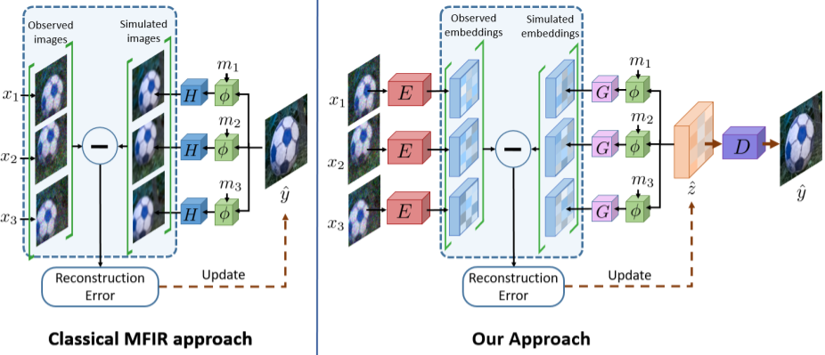

# Deep-Rep-MFIR

Official implementation of [**Deep Reparametrization of Multi-Frame Super-Resolution and Denoising**](https://arxiv.org/pdf/2108.08286.pdf)

**Publication:** Deep Reparametrization of Multi-Frame Super-Resolution and Denoising. Goutam Bhat, Martin Danelljan, Fisher Yu, Luc Van Gool, and Radu Timofte. ICCV 2021 **oral** 
[[Arxiv](https://arxiv.org/pdf/2108.08286.pdf)]

**Note:** The code for our CVPR2021 paper ["Deep Burst Super-Resolution"](https://arxiv.org/pdf/2101.10997.pdf) is available at [goutamgmb/deep-burst-sr](https://github.com/goutamgmb/deep-burst-sr)

## Overview

We propose a deep reparametrization of the maximum a
posteriori formulation commonly employed in multi-frame
image restoration tasks. Our approach is derived by introducing a learned error metric and a latent representation
of the target image, which transforms the MAP objective to
a deep feature space. The deep reparametrization allows
us to directly model the image formation process in the latent space, and to integrate learned image priors into the
prediction. Our approach thereby leverages the advantages
of deep learning, while also benefiting from the principled
multi-frame fusion provided by the classical MAP formulation. We validate our approach through comprehensive
experiments on burst denoising and burst super-resolution
datasets. Our approach sets a new state-of-the-art for both
tasks, demonstrating the generality and effectiveness of the
proposed formulation.


[Classical multi-frame image restoration approaches minimize a reconstruction error between the 
observed images and the simulated images to obtain the output image y. In contrast, we employ an 
encoder E to compute the reconstruction error in a learned feature space. The reconstruction error 
is minimized w.r.t. a latent representation z, which is then passed through the
decoder D to obtain the prediction y.]

## Table of Contents

* [Installation](#installation)
* [Toolkit Overview](#toolkit-overview)
* [Datasets](#datasets)
* [Evaluation](#evaluation)
* [Model Zoo](#model-zoo)
* [Training](#training)
* [Acknowledgement](#acknowledgement)

## Installation

#### Clone the Git repository.  
```bash
git clone https://github.com/goutamgmb/deep-rep.git
```
   
#### Install dependencies
Run the installation script to install all the dependencies. You need to provide the conda install 
path (e.g. ~/anaconda3) and the name for the created conda environment (here ```env-deeprep```).  
```bash
bash install.sh conda_install_path env-deeprep
```  
This script will also download the default DeepRep networks and create default environment settings.  

#### Update environment settings
The environment setting file [admin/local.py](admin/local.py) contains the paths for pre-trained networks, 
datasets etc. Update the paths in [local.py](admin/local.py) according to your local environment.

## Toolkit Overview
The toolkit consists of the following sub-modules.  
 - [actors](actors): Contains the actor classes for different trainings. The actor class is responsible for passing the input data through the network can calculating losses.
 - [admin](admin): Includes functions for loading networks, tensorboard etc. and also contains environment settings.  
 - [data](data): Contains functions for generating synthetic bursts, camera pipeline, processing data (e.g. loading images, data augmentations).
 - [data_specs](data_specs): Information about train/val splits of different datasets.
 - [dataset](dataset): Contains integration of datasets such as BurstSR, SyntheticBurst, ZurichRAW2RGB,
OpenImages, Grayscale denoising and Color denoising. 
 - [evaluation](evaluation): Scripts to run and evaluate models on standard datasets. 
 - [external](external): External dependencies, e.g. [PWCNet](https://github.com/sniklaus/pytorch-pwc).  
 - [models](models): Contains different layers and network definitions.  
 - [train_settings](train_settings): Default training settings for different models.
 - [trainers](trainers): The main class which runs the training.
 - [util_scripts](util_scripts): Util scripts to e.g. download datasets.  
 - [utils](utils): General utility functions for e.g. plotting, data type conversions, loading networks.


## Datasets
The toolkit provides integration for following datasets which can be used to train/evaluate the models.

<details>
  <summary><b>Zurich RAW to RGB Canon set</b></summary>

The RGB images from the training split of the 
[Zurich RAW to RGB mapping dataset](http://people.ee.ethz.ch/~ihnatova/pynet.html#dataset) 
can be used to generate synthetic bursts for training using the `SyntheticBurstProcessing` class in [data/processing.py](data/processing.py).

**Preparation:** Download the Zurich RAW to RGB canon set from [here](https://data.vision.ee.ethz.ch/bhatg/zurich-raw-to-rgb.zip) and unpack the zip folder. Set the 
`zurichraw2rgb_dir` variable in [admin/local.py](admin/local.py) to point to the unpacked dataset directory.

</details>

<details>
<summary><b>SyntheticBurst validation set</b></summary>

The pre-generated synthetic validation set introduced in [DBSR](https://arxiv.org/pdf/2101.10997.pdf) 
for the RAW burst super-resolution task. The dataset contains 300 synthetic bursts, each containing 
14 RAW images. The synthetic bursts are generated from the RGB images from the test split of the Zurich RAW to RGB mapping dataset. 
The dataset can be loaded using `SyntheticBurstVal` class in [dataset/synthetic_burst_val_set.py](dataset/synthetic_burst_val_set.py) file.

**Preparation:**  Download the dataset from [here](https://data.vision.ee.ethz.ch/bhatg/SyntheticBurstVal.zip) and unpack the zip file. 
Set the `synburstval_dir` variable in [admin/local.py](admin/local.py) to point to the unpacked dataset directory.


</details>

<details>
<summary><b>BurstSR dataset (cropped)</b></summary> 

The real-world BurstSR dataset introduced in [DBSR](https://arxiv.org/pdf/2101.10997.pdf) for the RAW burst 
super-resolution task. The dataset contains RAW bursts captured from Samsung Galaxy S8 and corresponding HR ground truths captured using a DSLR camera. 
This is the pre-processed version of the dataset that contains roughly aligned crops from the original images.
The dataset can be loaded using `BurstSRDataset` class in [dataset/burstsr_dataset.py](dataset/burstsr_dataset.py) file.
Please check the [DBSR paper](https://arxiv.org/pdf/2101.10997.pdf) for more details.


**Preparation:** The dataset has been split into 10 parts and can be downloaded and unpacked using the 
[util_scripts/download_burstsr_dataset.py](util_scripts/download_burstsr_dataset.py) script. 
Set the `burstsr_dir` variable in [admin/local.py](admin/local.py) to point to the unpacked BurstSR dataset directory.

</details>


<details>
<summary><b>BurstSR dataset (full)</b></summary> 

The real-world BurstSR dataset introduced in [DBSR](https://arxiv.org/pdf/2101.10997.pdf) for the RAW burst 
super-resolution task. The dataset contains RAW bursts captured from Samsung Galaxy S8 and corresponding HR ground truths captured using a DSLR camera. 
This is the raw version of the dataset containing the full burst images in dng format.


**Preparation:** The dataset can be downloaded and unpacked using the [util_scripts/download_raw_burstsr_data.py](util_scripts/download_raw_burstsr_data.py) script. 

</details>

<details>
<summary><b>OpenImages dataset</b></summary>

We use the RGB images from the [OpenImages](https://storage.googleapis.com/openimages/web/index.html) dataset to generate 
synthetic bursts when training the burst denoising models. 
The dataset can be loaded using `OpenImagesDataset` class in [dataset/openimages_dataset.py](dataset/openimages_dataset.py) file.

**Preparation:**  Download the dataset from [here](https://storage.googleapis.com/openimages/web/download.html). 
Set the `openimages_dir` variable in [admin/local.py](admin/local.py) to point to the downloaded dataset directory.

</details>

<details>
<summary><b>Grayscale Burst Denoising test set</b></summary>

The pre-generated synthetic grayscale burst denoising test set introduced in [KPN](https://bmild.github.io/kpn/index.html) paper. 
The dataset can be loaded using `GrayscaleDenoiseTestSet` class in [dataset/grayscale_denoise_test_set.py](dataset/grayscale_denoise_test_set.py) file.

**Preparation:**  Download the dataset from [here](https://drive.google.com/file/d/1UptBXV4f56wMDpS365ydhZkej6ABTFq1/view). 
Set the `kpn_testset_path` variable in [admin/local.py](admin/local.py) to point to the downloaded file.


</details>


<details>
<summary><b>Color Burst Denoising test set</b></summary>

The pre-generated synthetic color burst denoising test set introduced in [BPN](https://likesum.github.io/bpn/) paper. 
The dataset can be loaded using `ColorDenoiseTestSet` class in [dataset/color_denoise_test_set.py](dataset/color_denoise_test_set.py) file.

**Preparation:**  Download the dataset from [here](https://drive.google.com/file/d/1rXmauXa_AW8ZrNiD2QPrbmxcIOfsiONE/view) and unpack the zip file. 
Set the `bpn_color_testset_dir` variable in [admin/local.py](admin/local.py) to point to the unpacked dataset directory.


</details>

## Evaluation
You can run the trained models on the included datasets and compute the quality of predictions using the 
[evaluation](evaluation) module. 

**Note:** Please prepare the necessary datasets as explained in [Datasets](#Datasets) section before running the models.


<details>
<summary><b>Evaluate on SyntheticBurst validation set</b></summary> 

You can evaluate the models on SyntheticBurst validation set using [evaluation/synburst](evaluation/synburst) package. 
First create an experiment setting in [evaluation/synburst/experiments](evaluation/synburst/experiments) containing the list of 
models to evaluate. You can start with the provided setting [deeprep_default.py](evaluation/synburst/experiments/deeprep_default.py) as a reference.
Please refer to [network_param.py](evaluation/common_utils/network_param.py) for examples on how to specify a model for evaluation.

### Save network predictions
You can save the predictions of a model on bursts from SyntheticBurst dataset by running
```bash
python evaluation/synburst/save_results.py EXPERIMENT_NAME
```
Here, `EXPERIMENT_NAME` is the name of the experiment setting you want to use (e.g. `deeprep_default`). 
The script will save the predictions of the model in the directory pointed by the 
`save_data_path` variable in [admin/local.py](admin/local.py).

**Note** The network predictions are saved in linear sensor color space (i.e. color space of input RAW burst), 
as 16 bit pngs.

### Compute performance metrics
You can obtain the standard performance metrics (e.g. PSNR, MS-SSIM, LPIPS) using the 
[compute_score.py](evaluation/synburst/compute_score.py) script

```bash
python evaluation/synburst/compute_score.py EXPERIMENT_NAME
```
Here, `EXPERIMENT_NAME` is the name of the experiment setting you want to use (e.g. `deeprep_default`). 
The script will run the models to generate the predictions and compute the scores. In case you want 
to compute performance metrics for results saved using [save_results.py](evaluation/synburst/save_results.py), you 
can run [compute_score.py](evaluation/synburst/compute_score.py) with additonal `--load_saved` argument.
```bash
python evaluation/synburst/compute_score.py EXPERIMENT_NAME --load_saved
```
In this case, the script will load pre-saved predictions whenever available. If saved predictions are not available, 
it will run the model to first generate the predictions and then compute the scores.

### Qualitative comparison
You can perform qualitative analysis of the model by visualizing the saved network predictions, along with ground truth, in sRGB format 
using the [visualize_results.py](evaluation/synburst/visualize_results.py) script.
```bash
python evaluation/synburst/visualize_results.py EXPERIMENT_NAME
```
Here, `EXPERIMENT_NAME` is the name of the experiment setting containing the list of models you want to use (e.g. `deeprep_default`). 
The script will display the predictions of each model in sRGB format, along with the ground truth. You can toggle between images, 
zoom in on particular image regions using the UI. See [visualize_results.py](evaluation/synburst/visualize_results.py) for details.

**Note:** You need to first save the network predictions using [save_results.py](evaluation/synburst/save_results.py) script, 
before you can visualize them using visualize_results.py.

</details>


<details>
<summary><b>Evaluate on BurstSR validation set</b></summary> 

You can evaluate the models on BurstSR validation set using [evaluation/burstsr](evaluation/burstsr) package. 
First create an experiment setting in [evaluation/burstsr/experiments](evaluation/burstsr/experiments) containing the list of 
models to evaluate. You can start with the provided setting [deeprep_default.py](evaluation/burstsr/experiments/deeprep_default.py) as a reference. 
Please refer to [network_param.py](evaluation/common_utils/network_param.py) for examples on how to specify a model for evaluation.

### Save network predictions
You can save the predictions of a model on bursts from BurstSR val dataset by running
```bash
python evaluation/burstsr/save_results.py EXPERIMENT_NAME
```
Here, `EXPERIMENT_NAME` is the name of the experiment setting you want to use (e.g. `deeprep_default`). 
The script will save the predictions of the model in the directory pointed by the 
`save_data_path` variable in [admin/local.py](admin/local.py).

**Note** The network predictions are saved in linear sensor color space (i.e. color space of input RAW burst), 
as 16 bit pngs.

### Compute performance metrics
You can obtain the standard performance metrics (e.g. PSNR, MS-SSIM, LPIPS) **after** spatial and color alignment (see [paper](https://arxiv.org/pdf/2101.10997.pdf) for details)
using the [compute_score.py](evaluation/burstsr/compute_score.py) script

```bash
python evaluation/burstsr/compute_score.py EXPERIMENT_NAME
```
Here, `EXPERIMENT_NAME` is the name of the experiment setting you want to use (e.g. `deeprep_default`). 
The script will run the models to generate the predictions and compute the scores. In case you want 
to compute performance metrics for results saved using [save_results.py](evaluation/burstsr/save_results.py), you 
can run [compute_score.py](evaluation/burstsr/compute_score.py) with additonal `--load_saved` argument.
```bash
python evaluation/burstsr/compute_score.py EXPERIMENT_NAME --load_saved
```
In this case, the script will load pre-saved predictions whenever available. If saved predictions are not available, 
it will run the model to first generate the predictions and then compute the scores.

### Qualitative comparison
You can perform qualitative analysis of the model by visualizing the saved network predictions, along with ground truth, in sRGB format 
using the [visualize_results.py](evaluation/burstsr/visualize_results.py) script.
```bash
python evaluation/burstsr/visualize_results.py EXPERIMENT_NAME
```
Here, `EXPERIMENT_NAME` is the name of the experiment setting containing the list of models you want to use (e.g. `deeprep_default`). 
The script will display the predictions of each model in sRGB format, along with the ground truth. You can toggle between images, 
zoom in on particular image regions using the UI. See [visualize_results.py](evaluation/burstsr/visualize_results.py) for details.

**Note:** You need to first save the network predictions using [save_results.py](evaluation/burstsr/save_results.py) script, 
before you can visualize them using visualize_results.py.

</details>


<details>
<summary><b>Evaluate on Grayscale and Color denoising test sets</b></summary> 

You can evaluate the models on Grayscale and Color denoising test sets using [evaluation/burst_denoise](evaluation/burst_denoise) package. 
First create an experiment setting in [evaluation/burst_denoise/experiments](evaluation/burst_denoise/experiments) containing the list of 
models to evaluate. You can start with the provided setting [deeprep_color.py](evaluation/burst_denoise/experiments/deeprep_color.py) as a reference.
Please refer to [network_param.py](evaluation/common_utils/network_param.py) for examples on how to specify a model for evaluation.

### Save network predictions
You can save the predictions of a model on bursts from Grayscale/Color denoising datasets by running
```bash
python evaluation/burst_denoise/save_results.py EXPERIMENT_NAME MODE NOISE_LEVEL
```
Here, `EXPERIMENT_NAME` is the name of the experiment setting you want to use (e.g. `deeprep_default`). 
`MODE` denotes which dataset to use (can be `color` or `grayscale`). 
`NOISE_LEVEL` denotes the noise level to use (can be `1`, `2`, `4`, `8`, or `all`).
The script will save the predictions of the model in the directory pointed by the 
`save_data_path` variable in [admin/local.py](admin/local.py).

**Note** The network predictions are saved in linear color space (i.e. color space of input burst), 
as 16 bit pngs.

### Compute performance metrics
You can obtain the standard performance metrics (e.g. PSNR, MS-SSIM, LPIPS) using the 
[compute_score.py](evaluation/burst_denoise/compute_score.py) script

```bash
python evaluation/burst_denoise/compute_score.py EXPERIMENT_NAME MODE NOISE_LEVEL
```
Here, `EXPERIMENT_NAME` is the name of the experiment setting you want to use (e.g. `deeprep_default`). 
`MODE` denotes which dataset to use (can be `color` or `grayscale`). 
`NOISE_LEVEL` denotes the noise level to use (can be `1`, `2`, `4`, `8`, or `all`).
The script will run the models to generate the predictions and compute the scores. In case you want 
to compute performance metrics for results saved using [save_results.py](evaluation/burst_denoise/save_results.py), you 
can run [compute_score.py](evaluation/burst_denoise/compute_score.py) with additonal `--load_saved` argument.
```bash
python evaluation/burst_denoise/compute_score.py EXPERIMENT_NAME MODE NOISE_LEVEL --load_saved
```
In this case, the script will load pre-saved predictions whenever available. If saved predictions are not available, 
it will run the model to first generate the predictions and then compute the scores.

### Qualitative comparison
You can perform qualitative analysis of the model by visualizing the saved network predictions, along with ground truth, 
using the [visualize_results.py](evaluation/burst_denoise/visualize_results.py) script.
```bash
python evaluation/burst_denoise/visualize_results.py EXPERIMENT_NAME MODE NOISE_LEVEL
```
Here, `EXPERIMENT_NAME` is the name of the experiment setting containing the list of models you want to use (e.g. `deeprep_default`). 
`MODE` denotes which dataset to use (can be `color` or `grayscale`). 
`NOISE_LEVEL` denotes the noise level to use (can be `1`, `2`, `4`, `8`, or `all`).
The script will display the predictions of each model, along with the ground truth. You can toggle between images, 
zoom in on particular image regions using the UI. See [visualize_results.py](evaluation/burst_denoise/visualize_results.py) for details.

**Note:** You need to first save the network predictions using [save_results.py](evaluation/burst_denoise/save_results.py) script, 
before you can visualize them using visualize_results.py.

</details>


## Model Zoo
Here, we provide pre-trained network weights and report their performance. 

**Note:** The models have been retrained using the cleaned up code, and thus can have small performance 
differences compared to the models used for the paper.

<details>
<summary><b>SyntheticBurst models</b></summary> 

The models are evaluated using all 14 burst images.

|          Model         |  PSNR | MS-SSIM | LPIPS |                                            Links                                            | Notes                    |
|:----------------------:|:-----:|:-------:|:-----:|:-------------------------------------------------------------------------------------------:|--------------------------|
| ICCV2021               | 41.56 | 0.964   | 0.045 | -                                                                                           | ICCV2021 results         |
| deeprep_sr_synthetic_default | 41.55 | -   | - | [model](https://drive.google.com/file/d/1GZ0S4BKaZbgiy9WmoYH4kAsXY7zDR_ks/view?usp=sharing) | Official retrained model |

</details>

<details>
<summary><b>BurstSR models</b></summary> 

The models are evaluated using all 14 burst images. The metrics are computed after spatial and color alignment, as 
described in [DBSR paper](https://arxiv.org/pdf/2101.10997.pdf).

|          Model         |  PSNR | MS-SSIM | LPIPS |                                            Links                                            | Notes                    |
|:----------------------:|:-----:|:-------:|:-----:|:-------------------------------------------------------------------------------------------:|--------------------------|
| ICCV2021               | 48.33 | 0.985   | 0.023 | -                                                                                           | ICCV2021 results         |
| deeprep_sr_burstsr_default | - | -   | - | [model](https://drive.google.com/file/d/1qvV41jWgPShY2f-I6-xUbTzxcDWqFX_6/view?usp=sharing) | Official retrained model |

</details>

<details>
<summary><b>Grayscale denoising models</b></summary> 

The models are evaluated using all 8 burst images.

|          Model         |  Gain 1 | Gain 2 | Gain 4 | Gain 8 |                                            Links                                            | Notes                    |
|:----------------------:|:-----:|:-------:|:-----:|:-----:|:-------------------------------------------------------------------------------------------:|--------------------------|
| deeprep_denoise_grayscale_pwcnet | 39.37 | 36.51   | 33.38 | 29.69 |[model](https://drive.google.com/file/d/1Yt6qHeAexezqGfn-l9Zz0UpihhTtuMZu/view?usp=sharing) | Official retrained model |
| deeprep_denoise_grayscale_customflow | 39.10 | 36.14   | 32.89 | 28.98 |[model](https://drive.google.com/file/d/1KVZwVKdMvnliaA0uajJExbd9xTcdUTVJ/view?usp=sharing) | Official retrained model |

</details>

<details>
<summary><b>Color denoising models</b></summary> 

The models are evaluated using all 8 burst images.

|          Model         |  Gain 1 | Gain 2 | Gain 4 | Gain 8 |                                            Links                                            | Notes                    |
|:----------------------:|:-----:|:-------:|:-----:|:-----:|:-------------------------------------------------------------------------------------------:|--------------------------|
| deeprep_denoise_color_pwcnet | 42.21 | 39.13   | 35.75 | 32.52 |[model](https://drive.google.com/file/d/1wk8NqoLSAZYrhRdzvMXAyRJd4txta7QZ/view?usp=sharing) | Official retrained model |
| deeprep_denoise_color_customflow | 41.90 | 38.85   | 35.48 | 32.29 |[model](https://drive.google.com/file/d/1Up3k8Eb2NsaimeN3oLjp1x62owiB5fwW/view?usp=sharing) | Official retrained model |

</details>

## Training 
You can train the models using the [run_training.py](run_training.py) script. 
Please download and set up the necessary datasets as described in Datasets section, before starting the trainings. You will 
also need a pre-trained PWC-Net model to start the trainings. The model is automatically downloaded from 
the `install.sh` script. You can also download it manually using

```
gdown https://drive.google.com/uc\?id\=1s11Ud1UMipk2AbZZAypLPRpnXOS9Y1KO -O pretrained_networks/pwcnet-network-default.pth
```

You can train a model using the following command
```
python run_training.py MODULE_NAME PARAM_NAME
```
Here, `MODULE_NAME` is the name of the training module (e.g. `deeprep`), while `PARAM_NAME` is the 
name of the parameter setting file (e.g. `sr_synthetic_default`). We provide the default 
training settings used to obtain the results in the ICCV paper.
- [sr_synthetic_default](train_settings/deeprep/sr_synthetic_default.py): Train RAW burst super-resolution model on synthetic bursts. 
- [sr_burstsr_default](train_settings/deeprep/sr_burstsr_default.py): Train RAW burst super-resolution model on real-world BurstSR.
- [denoise_grayscale_pwcnet](train_settings/deeprep/denoise_grayscale_pwcnet.py): Train grayscale burst denoising model using pre-trained PWC-Net.
- [denoise_color_pwcnet](train_settings/deeprep/denoise_color_pwcnet.py): Train color burst denoising model using pre-trained PWC-Net.
- [denoise_grayscale_customflow](train_settings/deeprep/denoise_grayscale_customflow.py): Train grayscale burst denoising model using a custom optical flow network.
- [denoise_color_customflow](train_settings/deeprep/denoise_color_customflow.py): Train color burst denoising model using a custom optical flow network.

## Acknowledgement
The toolkit uses code from the following projects:
- Correlation module from [ClementPinard/Pytorch-Correlation-extension](https://github.com/ClementPinard/Pytorch-Correlation-extension).
- Forward and inverse camera pipeline code from [timothybrooks/unprocessing](https://github.com/timothybrooks/unprocessing).
- PWC-Net code from [sniklaus/pytorch-pwc](https://github.com/sniklaus/pytorch-pwc)
- PWC-Net pre-trained models from [NVlabs/PWC-Net](https://github.com/NVlabs/PWC-Net)
- MS-SSIM code from [jorge-pessoa/pytorch-msssim](https://github.com/jorge-pessoa/pytorch-msssim).
- Core code for the toolkit (e.g. saving and loading models) from [visionml/pytracking](https://github.com/visionml/pytracking)
